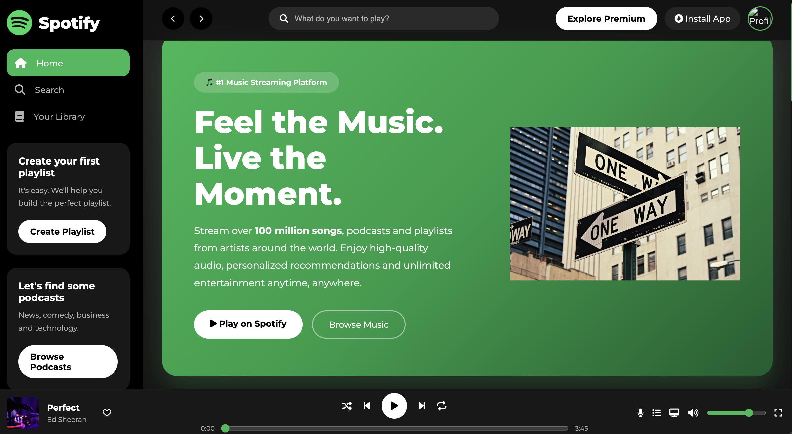

# 🎵 Spotify Clone

A modern and responsive **Spotify-inspired Music Streaming Web Application** built using **HTML, CSS, and JavaScript**.

This project recreates Spotify's elegant interface with a modern UI, responsive layout, smooth animations, and interactive music player components. It demonstrates strong frontend development skills, clean code organization, and responsive web design principles.


---

## 📸 Project Preview

<p align="center">
  
</p>

---

# ✨ Features

- 🎵 Spotify-inspired User Interface
- 📱 Fully Responsive Design
- 🎧 Interactive Music Player UI
- ❤️ Like Song Feature
- 🔍 Live Search Functionality
- 🎼 Featured Playlists
- 🎤 Popular Artists Section
- 🎙 Popular Podcasts
- 📈 Interactive Progress Bar
- 🔊 Volume Slider
- ⚡ Smooth Hover Animations
- 🌙 Modern Dark Theme
- 💻 Clean & Organized Code

---

# 🛠 Tech Stack

- HTML5
- CSS3
- JavaScript (ES6)
- Font Awesome
- Google Fonts

---

# 🚀 Getting Started

### Clone the Repository

```bash
git clone https://github.com/saurabh010904-lab/Spotify-clone.git
```

### Navigate to the Project

```bash
cd Spotify-clone
```

### Run the Project

Open **index.html** in your preferred browser.

> 💡 **Recommended:** Use the **Live Server** extension in Visual Studio Code for the best development experience.

---

# 📷 Screenshots

## 🏠 Home Page

<p align="center">
  
</p>

---

# 🎯 Future Improvements

- 🎵 Real Audio Playback
- 🎼 Playlist Management
- 🔐 User Authentication
- ❤️ Favorite Songs
- 🎶 Spotify Web API Integration
- 🌙 Dark / Light Mode
- 🎤 Lyrics Support
- 📱 Progressive Web App (PWA)

---

# 👨‍💻 About the Developer

## Saurabh Raj

**Full Stack Developer | MERN Stack Enthusiast**

I enjoy building responsive, user-friendly, and modern web applications while continuously learning new technologies and improving my development skills.

### Connect with Me

- 💼 **LinkedIn:** https://www.linkedin.com/in/saurabh-prajapat/
- 💻 **GitHub:** https://github.com/saurabh010904-lab/Spotify-clone

---

# 🤝 Contributing

Contributions, issues, and feature requests are welcome.

Feel free to fork this repository and submit a Pull Request.

---

# ⭐ Support

If you found this project useful, please consider giving it a ⭐ on GitHub.

Your support helps me continue building and improving open-source projects.

---

# 📄 License

This project is developed for **educational and portfolio purposes only**.

It is **not affiliated with, endorsed by, or associated with Spotify**.